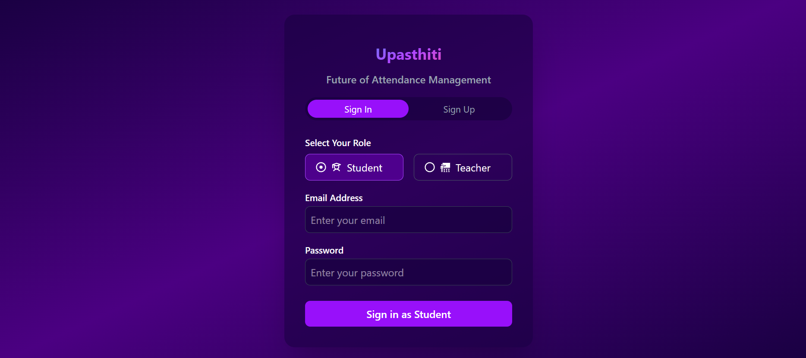
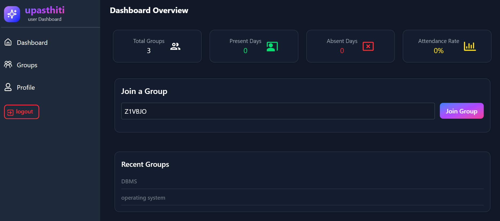
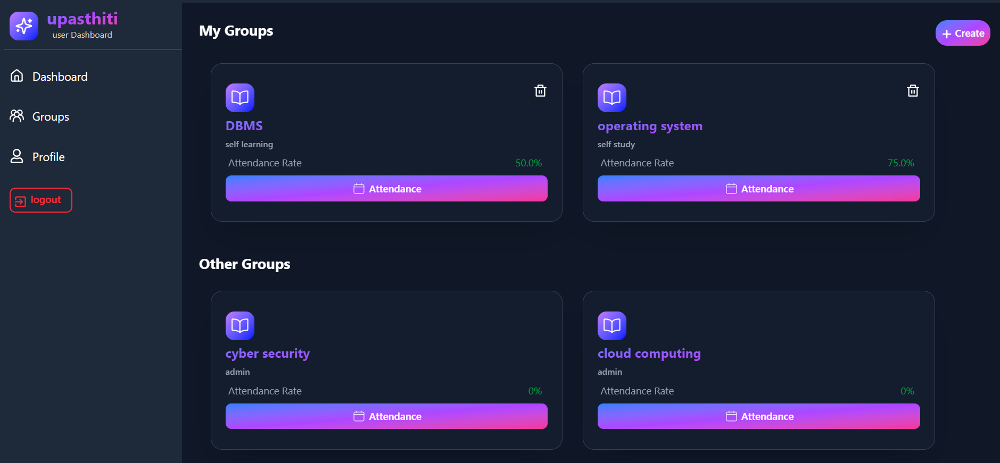
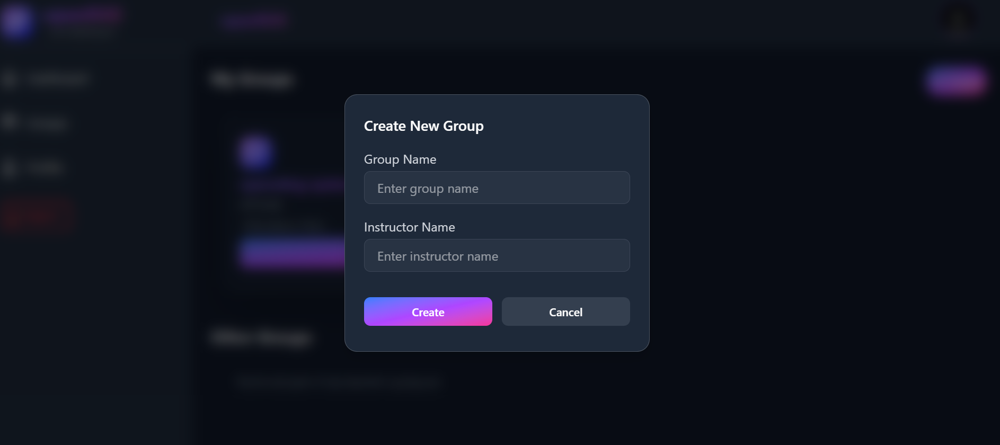
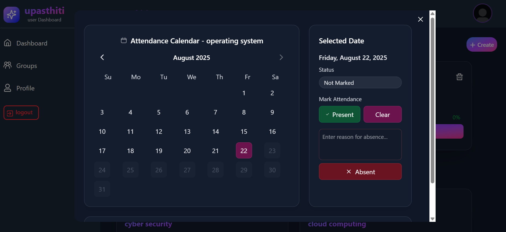
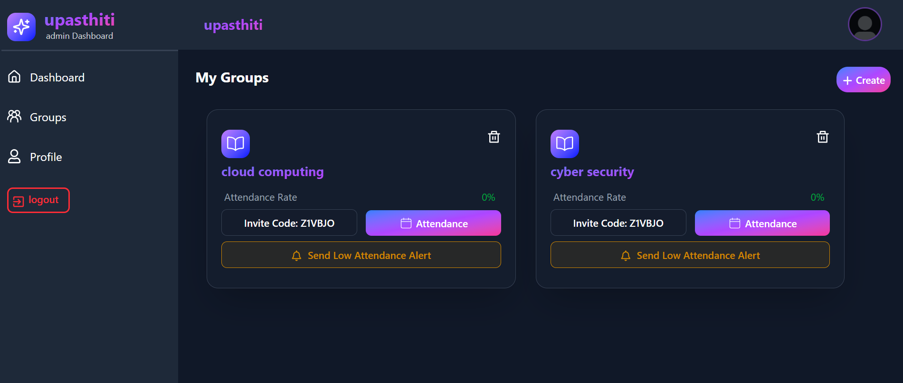
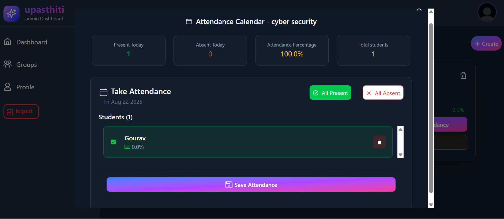

# Attendance Management App  

A modern **attendance tracking system** built with **React, Firebase, Zustand, and TailwindCSS**.  
This app helps instructors manage student groups, mark attendance (Present / Absent ), and provides students with their own attendance insights.  

---

## ✨ Features  

✅ **User Authentication** (Firebase Auth)  
✅ **Instructor & Student Roles**  
✅ **Group Management** (create / join groups via invite codes)  
✅ **Attendance Tracking**  
- Mark students as **Present / Absent / Holiday / Clear**
- **Bulk Actions** (Mark all Present / all Absent)
- Updates both **Instructor’s record** and **Student’s record**

✅ **Real-time Sync** with Firebase Firestore  
✅ **Attendance Rate Calculation**  
- Auto calculates `rate = (Present / (Present + Absent)) × 100`  

✅ **Responsive UI** with TailwindCSS  

---

## 🖥️ Tech Stack  

- ⚛️ **React** – Frontend  
- 🎨 **TailwindCSS** – Styling  
- 🔥 **Firebase Firestore** – Database  
- 🔐 **Firebase Auth** – Authentication  
- 🪝 **Zustand** – State management  
- 🔔 **React Toast** – Notifications

---

## App-preview

  
  
  
  
  
  
  

---
